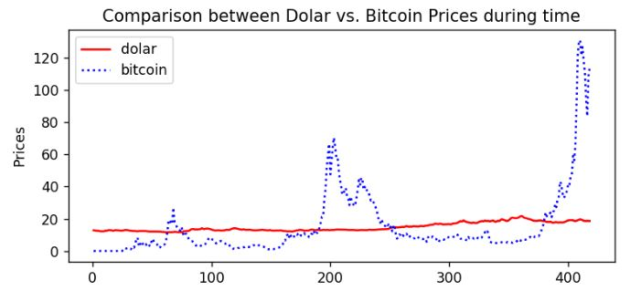
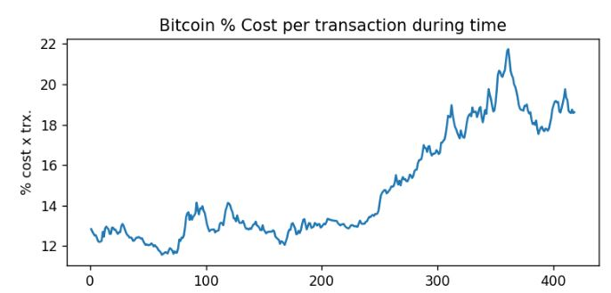

# ETL
### Summary
This repository contains a code that extracts data from Kaggle and Banxico APIs to gauge the performance of bitcoin versus the US dollar from 2010 to 2018. 
### Technical Details
In order to run the code, Jupyter Notebook and the following libraries are required: 
kaggle.api.kaggle_api_extended 
sqlalchemy 
### Screenshots
BitcoinVsUSD.JPG 
  
BitcoinCommissionVsTime.JPG 
  
### Explanations 
The outcome is shown in screenshots for reference purpose of the public. 

# ETL
The APIs from Kaggle and Banxico download the performance of the bitcoin and US dollar. 
The performance of bitcoin has been tracked to show its high variability, however, the US dollar was set as a standard with a much more stable growth over time. 
Having considered bitcoin as a currency, it's behavior resembles more like shares from a technological and foreign company than a commercial paper from a well established government. 
In such as case, the ability of bitcoin to buy products from certain retailers must be seen as a credit note or a voucher issued by the provider instead a legitimate currency. 
The US dollar is supported by assets, such as real state property and its gross domestic product.  
On the other hand, bitcoin relies exclusively on 'digital assets' whose value is determined subjectively and commissions are only worth how popular this 'investment' is in the market. 

